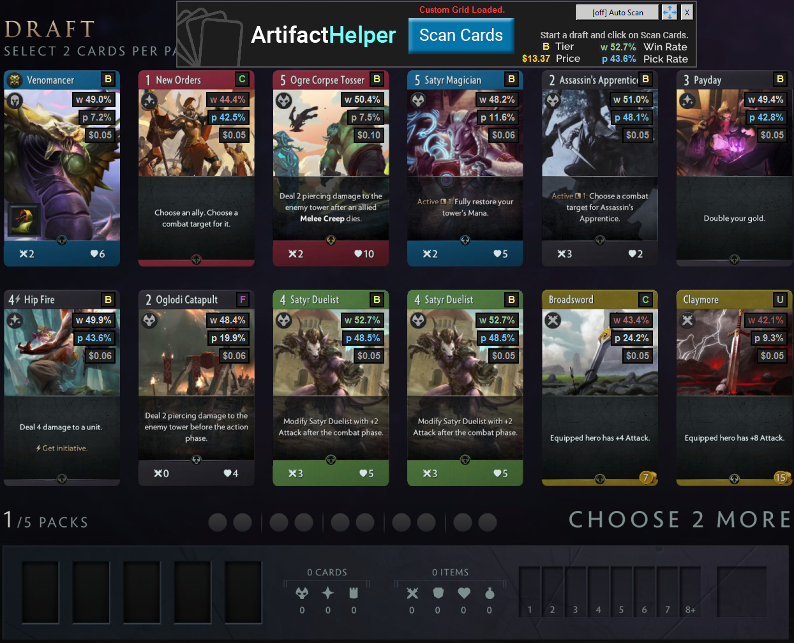

# Artifact Helper

A helper for Valve's Artifact draft mode that displays an overlay on individual cards showing stats gathered from [Artibuff](https://www.artibuff.com/), tier lists (default tier list is Hyped's from [DrawTwo](https://drawtwo.gg/hypeds-limited-tier-list)) and custom annotations.

## Getting Started

Download the latest [release](https://github.com/eoakley/artifacthelper/releases/latest).

### Prerequisites

* **Windows only**

* **Artifact running on borderless window mode**

* **Only works on 1080p resolution for now**

## How to use

After installation, simply launch the program via the start menu shortcut whenever you are going to draft.

If the program has properly loaded you will notice the Artifact Helper banner on top of the game. (remember that it won't work unless it is on **borderless window** mode).

## How does it work

We trained a simple neural network using [Keras](https://github.com/keras-team/keras) to classify cards based on its artwork.

Using tier lists and historic data, we can show each card's win rate, pick rate and tier.

We built an interface using [Tkinter](https://wiki.python.org/moin/TkInter) to create the overlay on top of the game.

## Building it yourself

It is also possible to build your own installation if you are an adventurer. Instructions on file "How to build.txt".

Artifact Helper was built with Python 3.6.5 and is distributed via a self contained environment (built with [Pynsist](https://github.com/takluyver/pynsist)).

Tested only on Windows 10.

## To do

* Add support for different resolutions and environments
* Add an option to automatically scan the cards
* Deck tracker
* Advanced card recomendadion (based on synergy and mana curve)

## Authors

* **[Eric Oakley](https://github.com/eoakley)** - *Initial work*
* **[João P. Vasques](https://github.com/miojo)** - *Initial work*
